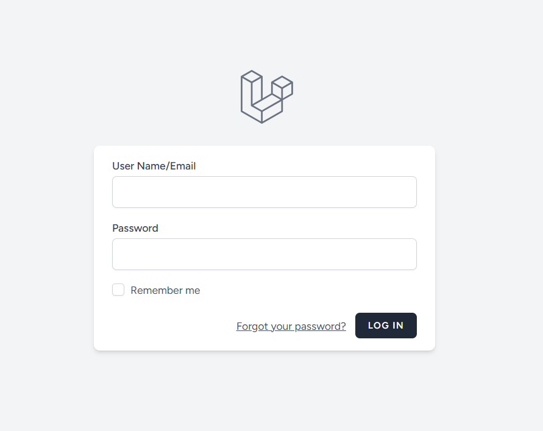
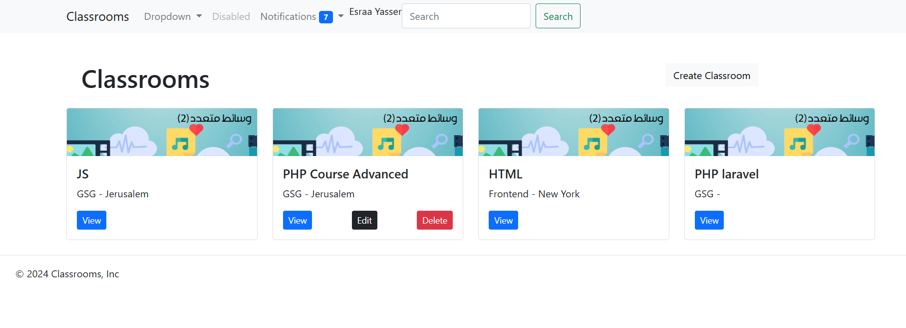
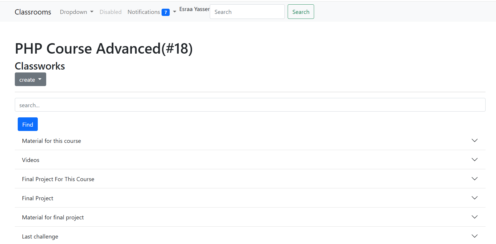
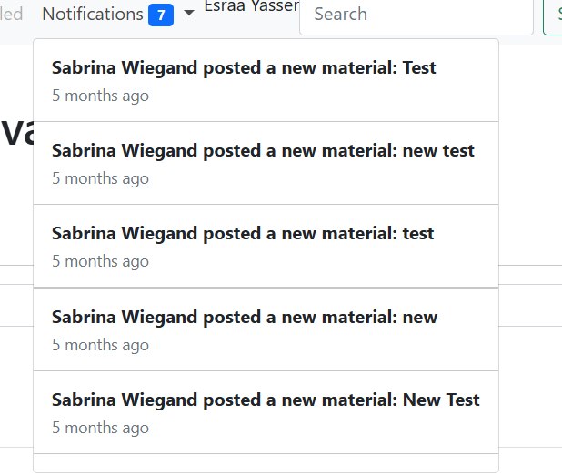
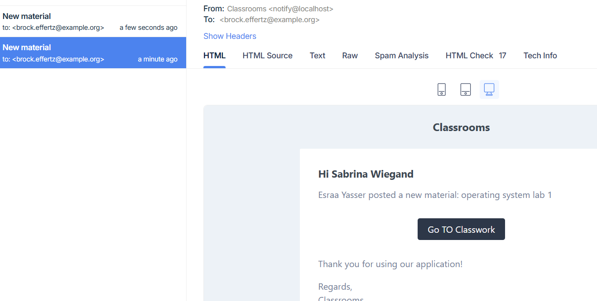
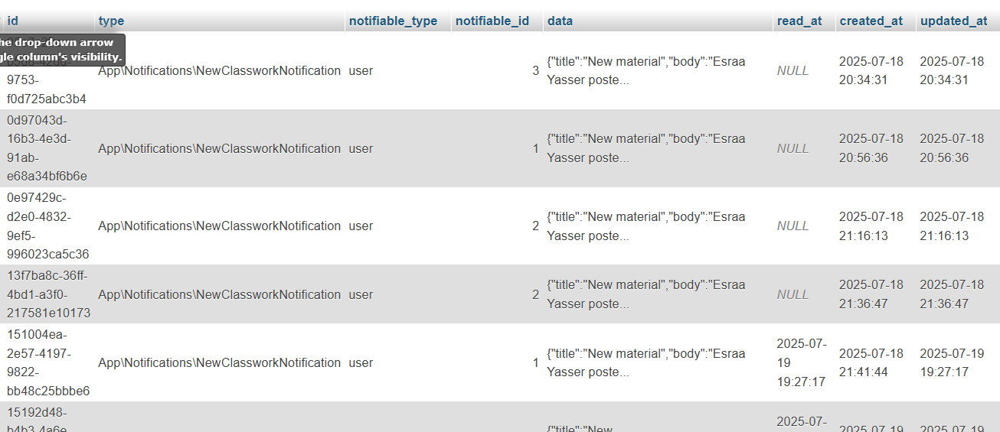
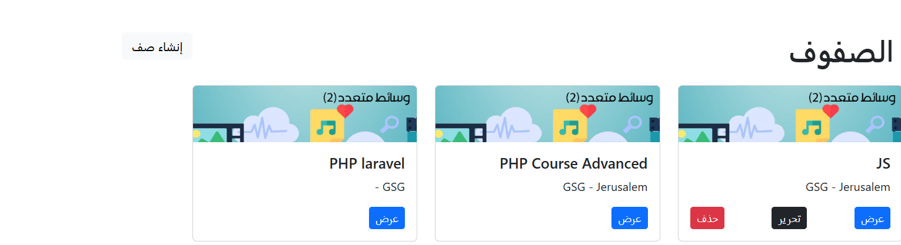
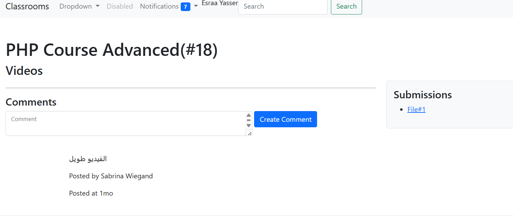

# Google Classroom Clone
> A production-level Laravel application demonstrating advanced backend development practices.
## 📌 Project Overview
A full-featured **Google Classroom Clone** built with **Laravel**, designed to manage virtual classrooms and educational workflows.  
The project demonstrates advanced Laravel concepts, clean architecture, and real-world backend features commonly used in production-level applications.
This project was built as a real-world Laravel application showcasing advanced backend development concepts.

---

## 🚀 Core Features
- Classroom management
- Classwork & assignments
- Assignment submission system
- Resource controllers
- Authentication & authorization
- RESTful API support
- Subscription & payment handling

---

## 🧠 Implemented Laravel Concepts

### 🔐 Authentication & Authorization
- Authentication UI and scaffolding provided by **Laravel Breeze**
- Custom authentication logic and multi-guard setup powered by **Laravel Fortify**
- Separation of user roles using multi-guard authentication (Teacher / Student)
- Authorization implemented via policies, gates, and middleware
- Secure token-based API authentication using **Laravel Sanctum**
- Sanctum middleware applied to protect sensitive API endpoints

---

### 🏫 Classroom & Academic Modules
- Classrooms management
- Classwork creation
- Assignments & submissions
- Relationships between teachers, students, and classes

---

### 🗄️ Database & Eloquent
- Eloquent ORM
- Model scopes
- Soft Deletes
- Relationships:
  - One-to-One
  - One-to-Many
  - Many-to-Many
  - Polymorphic Relationships

---

### 🎨 Frontend & UI
- Blade templates
- Blade layouts & components
- Form validation (server-side)
- Localization (multi-language support)

---

### 🔔 Events & Background Processing
- Laravel Events & Listeners
- Notifications (database & mail & broadcast & vonage)
- Jobs & Queues for background tasks

---

### 🌐 API
- RESTful API endpoints
- API authentication using **Laravel Sanctum**
- Secure token-based access
- JSON responses using API Resources

---

### 💳 Subscriptions & Payments
- Subscription-based access control
- Payment integration
- Secure transaction handling

---

### 🚢 Deployment
- Application deployment configuration
- Environment-based setup
- Production-ready structure

---

## 🛠️ Technologies Used
- **Backend:** Laravel
- **Frontend:** Blade, HTML, CSS, Bootstrap / Tailwind
- **Database:** MySQL
- **Authentication:** Laravel Auth & Multi-Guard
- **API Authentication:** Laravel Sanctum
- **Queue System:** Laravel Queues
- **Version Control:** Git & GitHub

---
  

## 🚀 Installation & Setup
1. Clone the repository:
```bash
git clone https://github.com/EsraaYaShamala/GoogleClassroomClone.git
```

2. Navigate to the project directory:
```bash
cd GoogleClassroomClone
```

3. Install PHP dependencies:
```bash
composer install
```

4. Copy and configure environment file:
```bash
cp .env.example .env
```

5. Generate Laravel application key:
```bash
php artisan key:generate
```

6 .Run migrations:
```bash
php artisan migrate
```

7. (Optional) Seed database:
```bash
php artisan db:seed
```

8.Run queues:
```bash
php artisan queue:work
```

9.Start development server:
```bash
php artisan serve
```
---

## 📈 Future Improvements
- Mobile-friendly API enhancements
- Advanced analytics & reporting
- Microservices-ready architecture

---

## 📸 Screenshots

### Login


### Classrooms List


### Classworks List


### Broadcast Notification 


### Email Notification (Mailtrap)


### Database Notification 


### Localization


### Submissions


---

## 🧑‍💻 Author
Esraa Yasser
📧 esraaaboshamala@gmail.com
🔗 https://github.com/EsraaYaShamala

---

## 📄 License
This project is for educational purposes and learning only.


